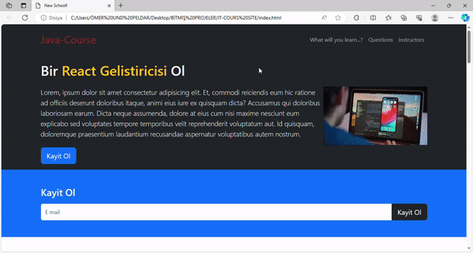

<h1>Java-Course-Site</h1>

This site I made is a software course site. It was created using libraries. It is a responsive project. Location feature is given by placing a map in it.

<h2>Libraries Used<h2>

getbootstrap.com

<h2>Languages<h2>

This project is written in CSS -HTML.

<h2>Screenshot<h2>

